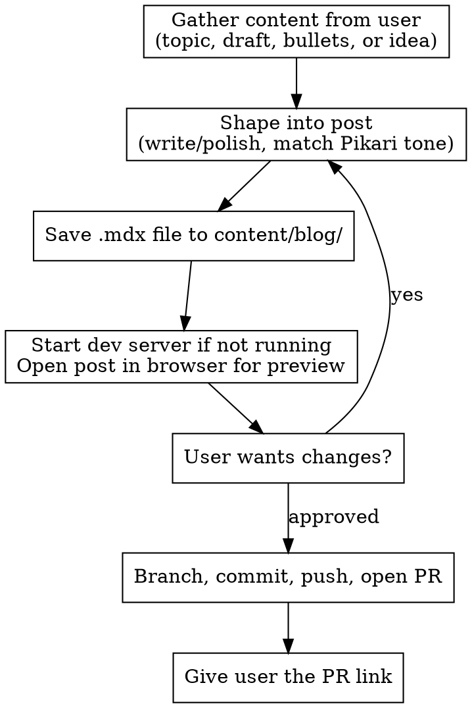

# Publish Blog Post

Create and publish blog posts to the Pikari website. Handles everything from content shaping through to opening a pull request.

## Workflow



## Content Guidelines

**Tone:** Professional but accessible. Research-backed, conversational. No marketing fluff. Short paragraphs (2-4 sentences). Concrete examples over theory.

**Length:** 6-12 minute reads, roughly 1,500-2,500 words.

**Structure:** Opening paragraph, 3-4 sections with H2 headings, no deep nesting. The `<Callout>` component is available for asides.

**Categories** (use exactly one):

- `Research` - analysis, patterns, insights
- `Frameworks` - repeatable methods and models
- `Case Studies` - deep dives on specific companies/teams
- `Field Notes` - practical lessons from real experience

**Authors:**

| Name          | Role               | Avatar                             |
| ------------- | ------------------ | ---------------------------------- |
| Elena Vasquez | Research Lead      | `photo-1580489944761-15a19d654956` |
| Marcus Obi    | Head of Research   | `photo-1507003211169-0a1dd7228f2d` |
| Aiko Tanaka   | Senior Writer      | `photo-1438761681033-6461ffad8d80` |
| David Park    | Product Strategist | `photo-1472099645785-5658abf4ff4e` |

Avatar URLs follow the pattern: `https://images.unsplash.com/{id}?w=200&q=80`

Ask the user which author to use. If they aren't sure, suggest based on category and topic.

## MDX File Format

Filename: kebab-case matching the title (e.g., `why-ai-needs-oversight.mdx`)

```mdx
---
title: 'Post Title'
category: 'Research'
date: 'YYYY-MM-DD'
excerpt: 'One or two sentence summary.'
image: 'https://images.unsplash.com/photo-XXXXX?w=800&q=80'
featured: false
readTime: 'X min read'
author:
  name: 'Elena Vasquez'
  role: 'Research Lead'
  avatar: 'https://images.unsplash.com/photo-1580489944761-15a19d654956?w=200&q=80'
---

Post content here using Markdown. Use ## for section headings.
```

For the cover `image`, pick a relevant Unsplash photo URL. Use `?w=800&q=80` params.

Set `date` to today's date. Estimate `readTime` based on word count (~200 words/min).

## Local Preview

Save the .mdx file to `content/blog/` BEFORE asking for approval. Then let the user see it rendered on the actual site.

**Starting the dev server:**

1. Check if the dev server is already running: `lsof -i :3000`
2. If not running, start it in the background: `npm run dev` (from the project root)
3. Wait for the server to be ready (check for "Ready" in output or poll `http://localhost:3000`)

**Opening the preview:**

- The post URL will be `http://localhost:3000/blog/<slug>` where `<slug>` is the filename without `.mdx`
- Open it with: `open http://localhost:3000/blog/<slug>`
- Tell the user: "I've opened a preview of your post in the browser. Take a look and let me know if you'd like any changes."

**Important:** Write the file first, then preview. Next.js hot-reloads automatically so changes appear immediately. If the user requests edits, update the file and tell them to refresh (or it will refresh automatically).

**Do NOT stop the dev server** when done -- leave it running for future previews.

## Git Workflow

Handle all git operations without explaining commands. If something goes wrong, fix it and explain what happened in plain language.

```bash
git pull origin main
git checkout -b blog/<short-slug>
# file is already saved from the preview step
git add content/blog/<filename>.mdx
git commit -m "Add blog post: <title>"
git push -u origin blog/<short-slug>
gh pr create --title "New post: <title>" --body "Adds blog post: <title>"
```

Give the user the PR link when done.

## How to Interact With the User

This skill is designed for non-technical users. Follow these principles:

1. **Ask, don't assume.** If the user gives you a topic or rough idea, ask clarifying questions before writing. What angle? Who's the audience? Any key points to hit?
2. **Preview, don't paste.** Don't dump raw MDX into the chat. Save the file and open the browser preview so the user sees the real thing. The rendered page is the draft.
3. **Hide the plumbing.** Don't explain git commands, branches, or file paths. Just do it and report the result: "Your post is up for review. Here's the link: ..."
4. **Speak plainly.** No jargon. If something fails, say what happened and what you did about it in one sentence.
5. **One thing at a time.** Don't overwhelm with options. Guide the conversation step by step.
6. **Clean up on cancel.** If the user decides not to publish, delete the .mdx file and any branch you created. Don't leave drafts lying around.
